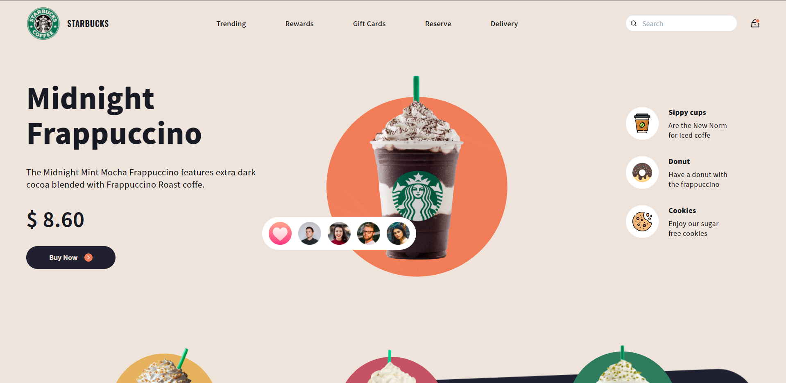

# Starbucks Website

 

## Challenge

I found this [design](https://dribbble.com/shots/15764131-Starbucks-Website-concept) by [Farzan Faruk](https://dribbble.com/farzanfaruk) and decided to bring it to life with React and Chakra UI.

Note: I didn't make it responsive...
 

## Technologies

Technologies and tools used in the development of the project:

- [React.js](https://reactjs.org/)
- [TypeScript](https://www.typescriptlang.org/)
- [Chakra UI](https://chakra-ui.com/)
 

## Licença

 

---
Made with 💖 by [**mmarinhomac**](https://github.com/mmarinhomac)